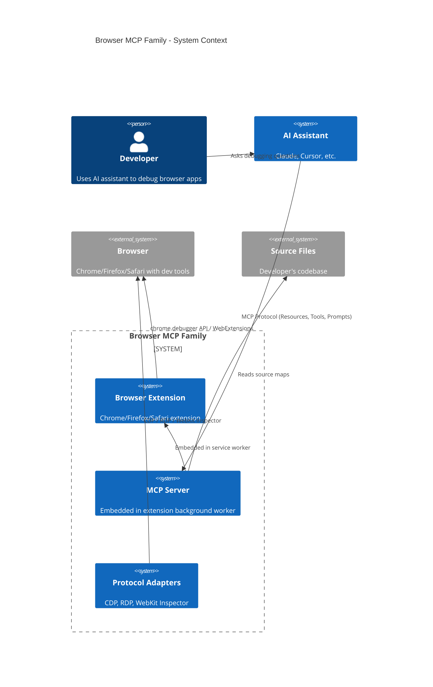

# Browser MCP Family - Architecture Design

**Version**: 1.0
**Date**: 2025-01-05
**Status**: Architecture Phase
**Architect Role**: Design Only - No Implementation

---

## Table of Contents

1. [Design Philosophy](#1-design-philosophy)
2. [System Architecture Overview](#2-system-architecture-overview)
3. [Design Document Index](#3-design-document-index)
4. [Project Structure](#4-project-structure)
5. [Technology Stack](#5-technology-stack)
6. [Development Workflow](#6-development-workflow)
7. [Compliance Matrix](#7-compliance-matrix)

---

## 1. Design Philosophy

### 1.1 Governing Principles

This architecture enforces the following **NON-NEGOTIABLE** principles from `.cursorrules`:

#### Interface Segregation Principle (ISP)
- **ALL** business logic MUST be behind interfaces
- Interfaces MUST be in completely separate `contracts/` project
- NO direct class instantiation - only through interface contracts
- Interfaces are IMMUTABLE once published (semantic versioning required)

#### Test-Driven Development (TDD)
- **NEVER** use mocks when real local implementation is feasible
- Use real browser instances (Chrome Debugger, Firefox RDP, WebKit Inspector)
- Use real local services (Redis for caching, SQLite for persistence if needed)
- Test infrastructure setup comes BEFORE implementation

#### Event-Driven Architecture
- Components communicate ONLY through events (EventEmitter3)
- Loose coupling - no direct component references
- Event naming: past-tense verbs (e.g., `TabActivated`, `FrameworkDetected`)
- Events are immutable once created
- **KEEP IT SIMPLE**: Start with basic pub/sub, no over-engineering

#### Simplicity (KISS + YAGNI + DRY)
- No premature abstractions
- Avoid over-engineering
- Prefer composition over inheritance
- No design patterns until absolutely necessary

#### Layer Separation
```
┌─────────────────────────────────────┐
│   Browser Extension UI (Views)      │ ← Pure presentation
├─────────────────────────────────────┤
│   MCP Server (Interfaces)           │ ← Protocol orchestration
├─────────────────────────────────────┤
│   Business Logic (Interfaces)       │ ← Framework detection, data extraction
├─────────────────────────────────────┤
│   Protocol Adapters (Interfaces)    │ ← CDP, RDP, WebKit Inspector
└─────────────────────────────────────┘
```

### 1.2 Core Design Constraints

| Constraint | Requirement | Rationale |
|-----------|-------------|-----------|
| **Data Provider Only** | NO embedded AI/LLM analysis | MCP provides data; external LLM analyzes |
| **Zero-Config** | Browser extension with one-click activation | Dead simple user experience |
| **Multi-Browser** | Chrome, Firefox, Safari support | Universal browser debugging |
| **Universal Frameworks** | 17+ frameworks (React, Vue, Blazor, Svelte, etc.) | Framework-agnostic inspection |
| **Source Mapping** | Live state ↔ source files ↔ mappings | Complete debugging context |
| **Sub-100ms Queries** | <100ms for most MCP resource reads | Interactive debugging performance |
| **Real Implementations** | No mocks in tests - real browser instances | Production-ready confidence |

---

## 2. System Architecture Overview

### 2.1 High-Level Architecture (C4 Context)



### 2.2 Container Architecture (C4 Container)

```mermaid
C4Container
    title Browser MCP Family - Container Architecture

    Container_Boundary(extension, "Browser Extension") {
        Container(serviceWorker, "Service Worker", "TypeScript", "Background process, MCP server host")
        Container(contentScript, "Content Script", "TypeScript", "Injected per tab, data extraction")
        Container(popup, "Popup UI", "HTML/TypeScript", "Activation interface")
    }

    Container_Boundary(mcpServer, "MCP Server (Embedded)") {
        Container(mcpProtocol, "MCP Protocol Handler", "TypeScript", "Resources, Tools, Prompts")
        Container(tabManager, "Tab Manager", "TypeScript", "Virtual filesystem per tab")
        Container(portManager, "Port Manager", "TypeScript", "Smart port allocation")
    }

    Container_Boundary(business, "Business Logic") {
        Container(frameworkDetector, "Framework Detector", "TypeScript", "Detects 17+ frameworks")
        Container(domExtractor, "DOM Extractor", "TypeScript", "Structured DOM data")
        Container(cssExtractor, "CSS Extractor", "TypeScript", "Cascade tracing")
        Container(sourceMapper, "Source Mapper", "TypeScript", "Maps runtime ↔ source")
    }

    Container_Boundary(adapters, "Protocol Adapters") {
        Container(cdpAdapter, "CDP Adapter", "TypeScript", "Chrome DevTools Protocol")
        Container(rdpAdapter, "RDP Adapter", "TypeScript", "Firefox Remote Debugging")
        Container(webkitAdapter, "WebKit Adapter", "TypeScript", "Safari Inspector")
    }

    Rel(popup, serviceWorker, "Activate tab debugging")
    Rel(serviceWorker, mcpProtocol, "Routes MCP requests")
    Rel(mcpProtocol, tabManager, "Query tab resources")
    Rel(tabManager, contentScript, "Message passing")
    Rel(contentScript, adapters, "Protocol commands")
    Rel(business, adapters, "Extract data")
    Rel(sourceMapper, sourceFiles, "Read source maps")
```

### 2.3 Event Flow Architecture

**Key Events** (EventEmitter3):

| Event | Payload | Emitter | Listeners |
|-------|---------|---------|-----------|
| `TabActivated` | `{ tabId, url, port }` | Extension Popup | Tab Manager, MCP Server |
| `TabDeactivated` | `{ tabId }` | Extension Popup | Tab Manager |
| `FrameworkDetected` | `{ tabId, framework, version }` | Framework Detector | Tab Manager, Content Script |
| `DOMUpdated` | `{ tabId, nodeCount }` | DOM Extractor | Tab Manager (cache invalidation) |
| `ResourceRequested` | `{ resourceUri }` | MCP Protocol Handler | Tab Manager, Business Logic |
| `PortAllocated` | `{ port, tabId }` | Port Manager | MCP Server |
| `SourceMapLoaded` | `{ url, mappings }` | Source Mapper | Tab Manager (cache update) |

---

## 3. Design Document Index

This master design document is supported by **detailed sub-documents** organized by functional family:

### Core Architecture
- **[INTERFACES.md](design/contracts/INTERFACES.md)** - Complete interface contracts (ISP enforcement)
- **[DATA-MODELS.md](design/data-structures/DATA-MODELS.md)** - All data structures and type definitions

### Browser Extension
- **[EXTENSION-DESIGN.md](design/browser-extension/EXTENSION-DESIGN.md)** - Extension architecture, manifest, service worker, content scripts
- **[PORT-DESIGN.md](design/port-management/PORT-DESIGN.md)** - Smart port allocation, multi-tab support

### MCP Server
- **[MCP-SERVER-DESIGN.md](design/mcp-server/MCP-SERVER-DESIGN.md)** - MCP protocol implementation, resources, tools, prompts
- **[VIRTUAL-FILESYSTEM.md](design/mcp-server/VIRTUAL-FILESYSTEM.md)** - Virtual filesystem mapping (browser://)

### Business Logic
- **[FRAMEWORK-DESIGN.md](design/framework-detection/FRAMEWORK-DESIGN.md)** - Framework detection for 17+ frameworks
- **[DOM-EXTRACTION.md](design/business-logic/DOM-EXTRACTION.md)** - DOM data extraction strategies
- **[CSS-EXTRACTION.md](design/business-logic/CSS-EXTRACTION.md)** - CSS cascade tracing
- **[SOURCE-MAPPING.md](design/business-logic/SOURCE-MAPPING.md)** - Source map integration

### Protocol Adapters
- **[PROTOCOL-DESIGN.md](design/protocol-adapters/PROTOCOL-DESIGN.md)** - CDP, RDP, WebKit Inspector adapters
- **[CDP-ADAPTER.md](design/protocol-adapters/CDP-ADAPTER.md)** - Chrome DevTools Protocol specifics
- **[RDP-ADAPTER.md](design/protocol-adapters/RDP-ADAPTER.md)** - Firefox Remote Debugging Protocol
- **[WEBKIT-ADAPTER.md](design/protocol-adapters/WEBKIT-ADAPTER.md)** - Safari WebKit Inspector

### Testing
- **[TDD-STRATEGY.md](design/testing/TDD-STRATEGY.md)** - Test-driven development workflow
- **[TEST-INFRASTRUCTURE.md](design/testing/TEST-INFRASTRUCTURE.md)** - Real browser test setup (no mocks)

### Performance & Optimization
- **[CACHING-STRATEGY.md](design/performance/CACHING-STRATEGY.md)** - Multi-tier caching (L1/L2/L3)
- **[QUERY-OPTIMIZATION.md](design/performance/QUERY-OPTIMIZATION.md)** - Sub-100ms query strategies

---

## 4. Project Structure

### 4.1 Monorepo Structure (ISP Compliant)

```
browser-mcp/
├── contracts/                      # ⚠️ IMMUTABLE INTERFACE PROJECT
│   ├── package.json               # Independently versioned (v1.0.0)
│   ├── mcp-server/
│   │   ├── IMCPServer.ts
│   │   ├── ITabManager.ts
│   │   └── IPortManager.ts
│   ├── business-logic/
│   │   ├── IFrameworkDetector.ts
│   │   ├── IDOMExtractor.ts
│   │   ├── ICSSExtractor.ts
│   │   └── ISourceMapper.ts
│   ├── protocol-adapters/
│   │   ├── IBrowserProtocolAdapter.ts
│   │   ├── ICDPAdapter.ts
│   │   ├── IRDPAdapter.ts
│   │   └── IWebKitAdapter.ts
│   ├── events/
│   │   ├── IEventBus.ts
│   │   └── EventSchemas.ts        # Event payload definitions
│   └── types/
│       ├── DOMTypes.ts
│       ├── CSSTypes.ts
│       ├── FrameworkTypes.ts
│       └── SourceMapTypes.ts
│
├── extension-chromium/             # Chrome/Edge browser extension
│   ├── manifest.json              # Manifest v3
│   ├── background/
│   │   ├── service-worker.ts      # MCP server embedded here
│   │   ├── tab-manager.ts
│   │   └── port-manager.ts
│   ├── content/
│   │   ├── content-script.ts
│   │   └── framework-detector.ts
│   ├── popup/
│   │   ├── popup.html
│   │   ├── popup.ts
│   │   └── popup.css
│   └── package.json
│
├── extension-firefox/              # Firefox browser extension
│   ├── manifest.json              # WebExtensions manifest
│   └── [similar structure]
│
├── extension-safari/               # Safari browser extension
│   ├── manifest.json
│   └── [similar structure]
│
├── core/                           # Business logic implementations
│   ├── package.json
│   ├── framework-detection/
│   │   ├── UniversalFrameworkDetector.ts   # Implements IFrameworkDetector
│   │   ├── ReactDetector.ts
│   │   ├── VueDetector.ts
│   │   ├── BlazorDetector.ts
│   │   └── [15 more framework detectors]
│   ├── dom-extraction/
│   │   ├── DOMExtractor.ts        # Implements IDOMExtractor
│   │   └── DOMSerializer.ts
│   ├── css-extraction/
│   │   ├── CSSExtractor.ts        # Implements ICSSExtractor
│   │   └── CascadeTracer.ts
│   └── source-mapping/
│       ├── SourceMapper.ts        # Implements ISourceMapper
│       └── SourceMapParser.ts
│
├── infrastructure/                 # Technical implementations
│   ├── package.json
│   ├── protocol-adapters/
│   │   ├── CDPAdapter.ts          # Implements ICDPAdapter
│   │   ├── RDPAdapter.ts          # Implements IRDPAdapter
│   │   └── WebKitAdapter.ts       # Implements IWebKitAdapter
│   ├── event-bus/
│   │   └── EventEmitterBus.ts     # EventEmitter3 wrapper, implements IEventBus
│   └── caching/
│       ├── L1Cache.ts             # In-memory hot cache
│       ├── L2Cache.ts             # Redis warm cache (optional)
│       └── CacheManager.ts
│
├── mcp-server/                     # MCP protocol implementation
│   ├── package.json
│   ├── MCPServer.ts               # Implements IMCPServer
│   ├── ResourceProviders/
│   │   ├── ConsoleResourceProvider.ts
│   │   ├── DOMResourceProvider.ts
│   │   ├── CSSResourceProvider.ts
│   │   └── ComponentResourceProvider.ts
│   ├── ToolProviders/
│   │   ├── QueryDOMTool.ts
│   │   ├── TraceCSSCascadeTool.ts
│   │   └── GetComponentStateTool.ts
│   └── PromptProviders/
│       └── DebuggingPrompts.ts
│
├── test-harnesses/                 # TDD test infrastructure
│   ├── package.json
│   ├── browser-instances/
│   │   ├── ChromeTestInstance.ts  # Real Chrome with debugger
│   │   ├── FirefoxTestInstance.ts # Real Firefox with RDP
│   │   └── SafariTestInstance.ts  # Real Safari with WebKit
│   ├── test-apps/                 # Sample apps for testing
│   │   ├── react-app/
│   │   ├── vue-app/
│   │   ├── blazor-app/
│   │   └── svelte-app/
│   ├── integration/
│   │   ├── extension.integration.test.ts
│   │   ├── mcp-server.integration.test.ts
│   │   └── framework-detection.integration.test.ts
│   └── docker-compose.yml         # Local test services (Redis, etc.)
│
├── docs/
│   ├── design/                    # This directory - all design docs
│   ├── adr/                       # Architecture Decision Records
│   └── diagrams/                  # PlantUML/Mermaid diagrams
│
├── REQUIREMENTS.md                # Comprehensive requirements
├── DESIGN.md                      # This file - master architecture
├── .cursorrules                   # Architectural mandates
├── package.json                   # Monorepo root
└── turbo.json                     # Turborepo config (if using)
```

### 4.2 Dependency Flow (ISP Enforcement)

```
contracts/          ← NO DEPENDENCIES (immutable)
    ↑
    ├── core/                   ← Depends ONLY on contracts
    ├── infrastructure/         ← Depends ONLY on contracts
    ├── mcp-server/             ← Depends ONLY on contracts
    └── extension-chromium/     ← Depends ONLY on contracts

All implementations get composed via dependency injection at runtime.
```

---

## 5. Technology Stack

### 5.1 Core Technologies

| Layer | Technology | Rationale |
|-------|-----------|-----------|
| **Language** | TypeScript 5.3+ | Type safety, interface support, broad browser compatibility |
| **Runtime** | Browser Extension APIs | Chrome (`chrome.*`), Firefox (`browser.*`), Safari (`safari.*`) |
| **Event Bus** | EventEmitter3 | Lightweight, fast, battle-tested pub/sub |
| **MCP Protocol** | `@modelcontextprotocol/sdk` | Official MCP SDK |
| **Protocol Adapters** | Native browser APIs | `chrome.debugger`, `browser.debugger`, WebKit remote inspector |
| **Testing** | Vitest + Puppeteer | Fast unit tests + real browser instances |
| **Caching** | In-memory Map (L1) | Sub-100ms access for hot data |
| **Source Maps** | `source-map` library | Mozilla's source-map parser |
| **Monorepo** | Turborepo (optional) | Fast builds, caching |

### 5.2 Browser APIs

| Browser | API | Protocol |
|---------|-----|----------|
| **Chrome/Edge** | `chrome.debugger` | Chrome DevTools Protocol (CDP) |
| **Firefox** | `browser.debugger` | Remote Debugging Protocol (RDP) |
| **Safari** | `safari.extension` | WebKit Remote Inspector Protocol |

### 5.3 Development Tools

| Tool | Purpose |
|------|---------|
| **Vitest** | Unit testing with real implementations |
| **Puppeteer** | Automated browser testing (Chrome) |
| **Playwright** | Cross-browser testing (Chrome, Firefox, WebKit) |
| **ESLint** | Code quality enforcement |
| **Prettier** | Code formatting |
| **TypeDoc** | API documentation generation |
| **Docker** | Local test infrastructure (Redis, test services) |

---

## 6. Development Workflow

### 6.1 TDD Workflow (Strict)

```
1. Interface First
   ├── Define interface in contracts/
   ├── Define event schemas if needed
   └── Version contracts package (v1.0.0)

2. Test Infrastructure
   ├── Set up real browser instance (Chrome/Firefox/Safari)
   ├── Set up test app (React/Vue/Blazor)
   └── Verify browser debugging connection

3. Write Test (Red Phase)
   ├── Test against interface contract
   ├── Use real browser, real protocol
   └── Test fails (no implementation yet)

4. Implement (Green Phase)
   ├── Implement interface in core/ or infrastructure/
   ├── Test passes with real browser
   └── No mocks used

5. Refactor (Blue Phase)
   ├── Optimize implementation
   ├── Tests still pass
   └── Performance validated (<100ms queries)

6. Integration Test
   ├── Test composed interfaces together
   ├── Real browser + real MCP server
   └── End-to-end validation

7. Production Ready
   └── Deploy extension to Chrome/Firefox/Safari stores
```

### 6.2 Interface Versioning

**Semantic Versioning** (contracts package):

- **MAJOR** (v2.0.0): Breaking changes (create new interface `IServiceV2`)
- **MINOR** (v1.1.0): Add new methods (existing methods unchanged)
- **PATCH** (v1.0.1): Documentation/type fixes only

**Example**:
```typescript
// contracts/package.json - v1.0.0
export interface IFrameworkDetector {
  detect(nodeId: number): Promise<FrameworkData | null>;
}

// contracts/package.json - v1.1.0 (MINOR - added method)
export interface IFrameworkDetector {
  detect(nodeId: number): Promise<FrameworkData | null>;
  detectAll(): Promise<FrameworkData[]>; // NEW - non-breaking
}

// contracts/package.json - v2.0.0 (MAJOR - breaking change)
export interface IFrameworkDetectorV2 {
  detect(nodeId: number, options?: DetectOptions): Promise<FrameworkData | null>; // Changed signature
}
```

---

## 7. Compliance Matrix

### 7.1 Requirements Compliance

| Requirement | Design Element | Status |
|-------------|---------------|--------|
| **ISP Enforcement** | Separate `contracts/` project with semantic versioning | ✅ Compliant |
| **TDD Enforcement** | Real browser instances in `test-harnesses/` | ✅ Compliant |
| **Event-Driven** | EventEmitter3 in `infrastructure/event-bus/` | ✅ Compliant |
| **No Mocks** | Puppeteer/Playwright for real browser testing | ✅ Compliant |
| **Layer Separation** | Extension → MCP → Business → Adapters | ✅ Compliant |
| **Zero-Config** | Browser extension with one-click activation | ✅ Compliant |
| **Multi-Browser** | Chrome, Firefox, Safari protocol adapters | ✅ Compliant |
| **Universal Frameworks** | 17+ framework detectors in `core/` | ✅ Compliant |
| **Source Mapping** | `source-mapper/` in `core/` | ✅ Compliant |
| **Sub-100ms Queries** | Multi-tier caching strategy | ✅ Compliant |
| **Smart Port Management** | `PortManager` in extension background | ✅ Compliant |

### 7.2 .cursorrules Compliance

| Rule | Implementation | Status |
|------|----------------|--------|
| **ISP (MUST)** | All interfaces in `contracts/` project | ✅ |
| **TDD (MUST)** | Test harnesses with real browsers first | ✅ |
| **Event-Driven (MUST)** | EventEmitter3 for all cross-component communication | ✅ |
| **Real Implementations (MUST)** | Puppeteer/Playwright, no mocked browsers | ✅ |
| **KISS + YAGNI** | Simple pub/sub events, no event sourcing/CQRS | ✅ |
| **Layer Separation (MUST)** | UI → MCP → Business → Adapters | ✅ |
| **Immutable Interfaces (MUST)** | Semantic versioning for `contracts/` | ✅ |
| **No Generic Names** | Specific names (e.g., `IFrameworkDetector` not `IDetector`) | ✅ |

---

## Next Steps

**For Implementation Teams**:

1. **Read all sub-design documents** in order:
   - Start with [INTERFACES.md](design/contracts/INTERFACES.md) - understand all contracts
   - Read [TDD-STRATEGY.md](design/testing/TDD-STRATEGY.md) - set up test infrastructure first
   - Read domain-specific designs (extension, MCP server, business logic, adapters)

2. **Set up development environment**:
   - Install TypeScript, Vitest, Puppeteer
   - Set up Docker for local test services
   - Clone/build test apps (React, Vue, Blazor)

3. **Follow TDD workflow** (Section 6.1):
   - Start with `contracts/` interfaces
   - Write tests with real browsers FIRST
   - Implement against passing tests
   - Never use mocks

4. **Review Architecture Decision Records** (ADRs):
   - All major decisions documented in `docs/adr/`
   - Understand rationale before implementation

---

**END OF MASTER DESIGN DOCUMENT**

See [Design Document Index](#3-design-document-index) for detailed designs organized by functional family.
